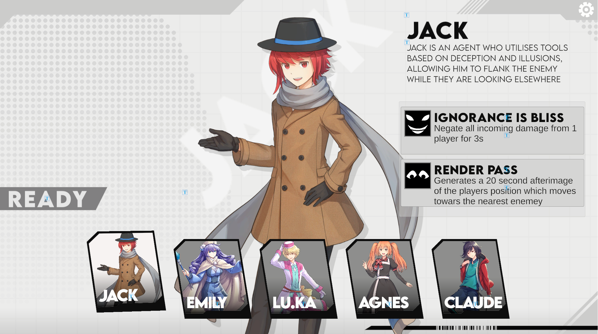
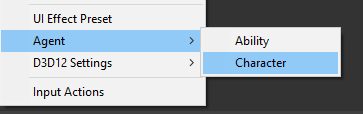
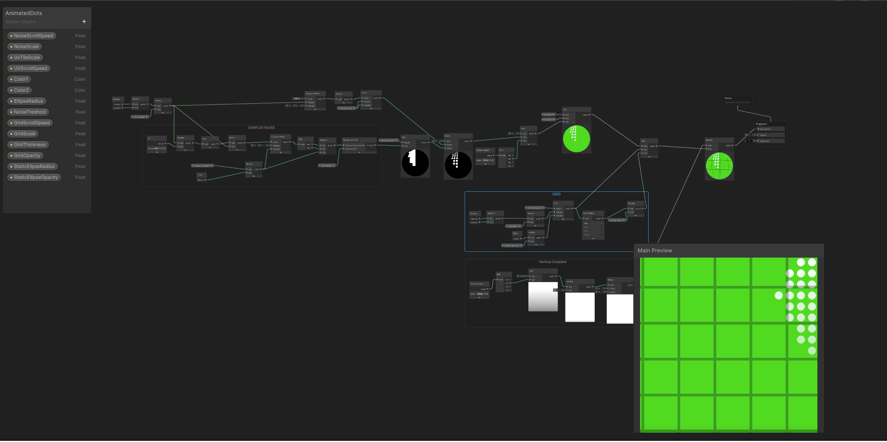

# Character Selection Demo

For this project, I decided to create a character selection UI demo for a hypothetical multiplayer game inspired by titles such as Marvel Rivals and Valorant. As a programmer, my goal was to implement as many of the UI animations and shaders as possible procedurally using tweens and Unity's Shader Graph, rather than relying on traditional keyframing, external animation tools or prerendered static backgrounds. This approach allowed greater flexibility, easier iteration, and more dynamic control over Shaders,UI transitions, and interactions directly through code.

# Project Web Demo
[Web Demo- PC recommended](https://rbocarro.github.io/UIDemo02/)

# Tools Used

## PrimeTween
This project untilises PrimeTween for handling all UI animations and transitions. I evaluated it against other tweening libraries such as DOTween, LeanTween and found PrimeTween to offer better performance. It allows for  easy chaining of tweens and sequencing of animations without additional overhead. 

#### Link:
[PrimeTween](https://github.com/KyryloKuzyk/PrimeTween)

## ScriptableObject

Unity’s ScriptableObject system was used to manage character data, including abilities, artwork, and profile information. This allows game designers to create and modify character data directly in the Unity Editor without altering code, promoting a clear separation between data and logic, making the system highly extensible and designer-friendly.

## Shader Graph

sdfsfsf aedfasd

## Improvements
If given more time, This project could benefit from improvements such as cleaning up code structure to improve readability and better compartmentalised functions.

+ Calculation of Simplex noise is expensive, especially in 3 dimensions so steps could be made to reduce computation reqirement such as using a prerendered video of the noise animation.

