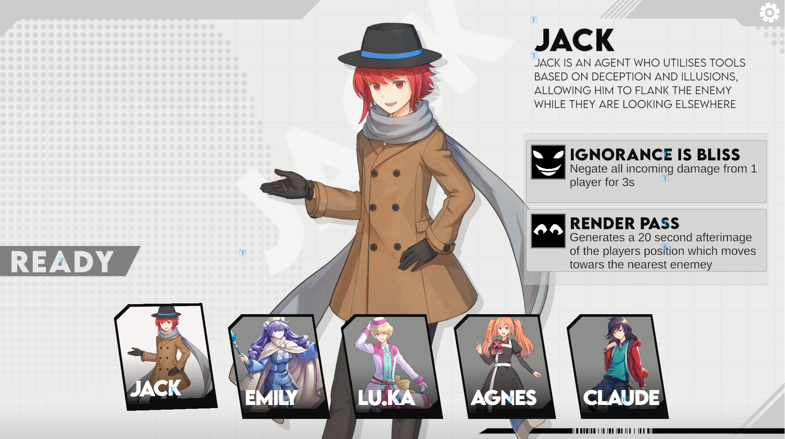
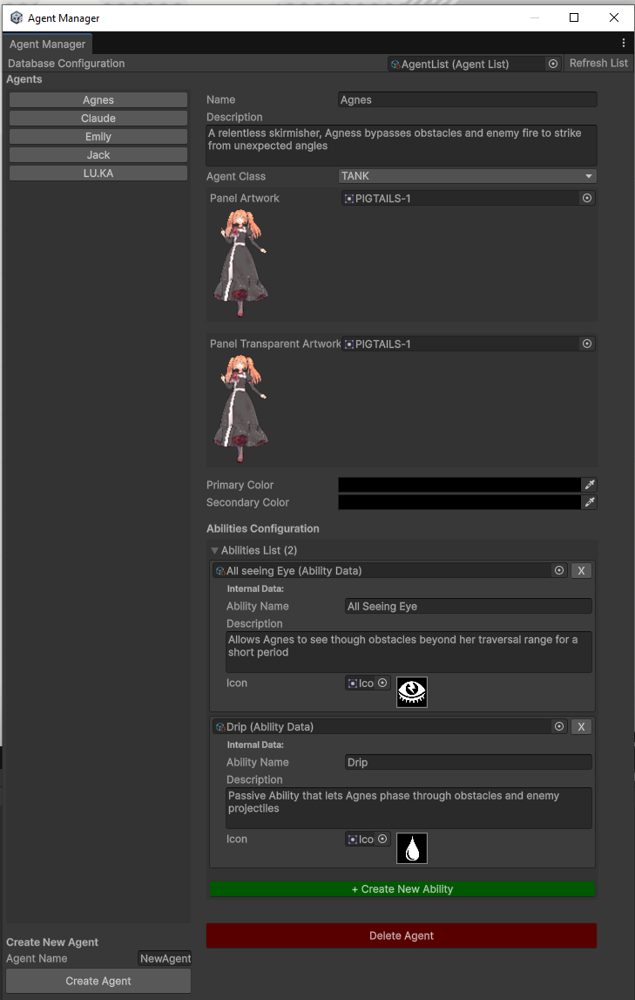
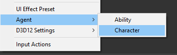
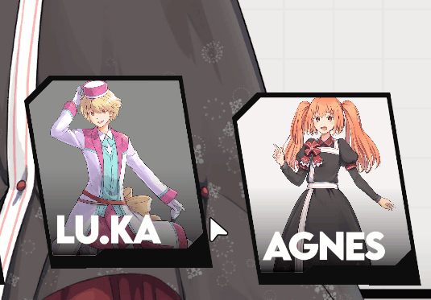
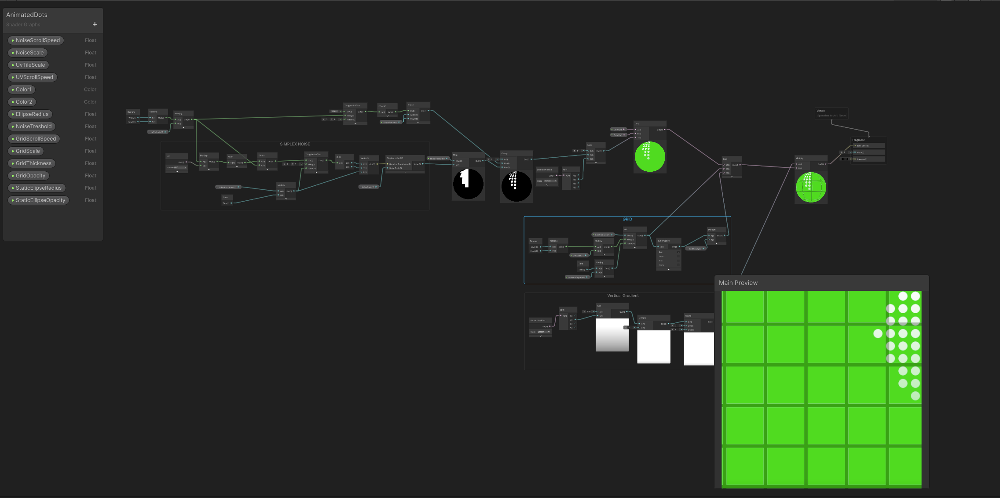
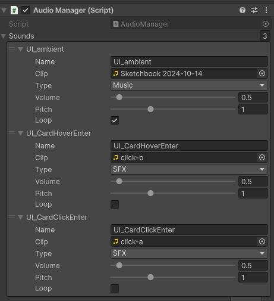

# Character Selection Demo

For this project, I decided to create a character selection UI demo for a hypothetical multiplayer game inspired by titles such as Marvel Rivals and Valorant. As a programmer, my goal was to implement the UI animations and shaders paramerically using tweens and Unity's Shader Graph, rather than relying on external animation tools or prerendered dynamic backgrounds. I also aimed to create a custom editor tool within the Unity Editor system that would allow game designers to easily create, modify and delete characters without needing to rely on external tools or the Inspector. This approach allowed greater flexibility and control over the character creation system, Shaders,UI transitions and interactions directly through the Unity Editor.

# Web Demo
[Web Demo- PC recommended](https://rbocarro.github.io/UI_CharacterSelect_Demo01/Build/)

# Tools Used

## Agent Manager Editor 
 
Custom Editor interface created using Unity's Editor Class which allows designers to easily create, edit and delete AgentCharacter and their linked Abilities, automatically handling file organisation and asset linking. This helps streamlines content creation, enabling faster iteration and easier data maintenance without needing to manually navigate the Project window.

## ScriptableObject
 
Unity’s ScriptableObject system was used to manage character data, including abilities, artwork, and profile information. This allows game designers to create and modify character data directly in the Unity Editor without altering code, promoting a clear separation between data and logic, making the system highly extensible and designer-friendly.

## PrimeTween
 
This project untilises PrimeTween for handling UI animations and transitions. I evaluated it against other tweening libraries such as DOTween, LeanTween and found PrimeTween to offer better performance. It allows for easy chaining of tweens and sequencing of animations without additional overhead. 

#### Link:
[PrimeTween](https://github.com/KyryloKuzyk/PrimeTween)

## Shader Graph

I used Unity’s Shader Graph to create the  scrolling background featured in the demo. The animated dot pattern is achieved through UV tiling and time-based displacement, which is then masked using an animated Simplex Noise node. A clipping threshold controls the visibility of the dots within the noise mask, producing a dynamic, organic motion effect. The grid overlay is animated in a similar manner, utilising UV tiling and displacement.

## AudioManager
 
I implemented a static AudioManager in Unity to handle sound playback. The system is based on Brackeys’ Audio Manager tutorial but improved for efficiency by using a Dictionary lookup to access audio clips instead of relying on FindObjectOfType, which performs a linear search.The AudioManager also supports a tag-based classification system, allowing sounds to be grouped into categories such as Music or SFX. This enables fine-grained control over audio attributes like volume and mixing, both globally and per category. 

## Improvements
+ Calculation of Simplex noise is expensive, especially in 3 dimensions so steps could be made to reduce computation reqirement such as using a prerendered video of the noise animation.

##References
+[Free Anime Character Art Pack - 6 by NatsuyaCharacterArt](https://assetstore.unity.com/packages/2d/characters/free-anime-character-art-pack-6-303256) - [Twitter](https://x.com/natsuyaen)

